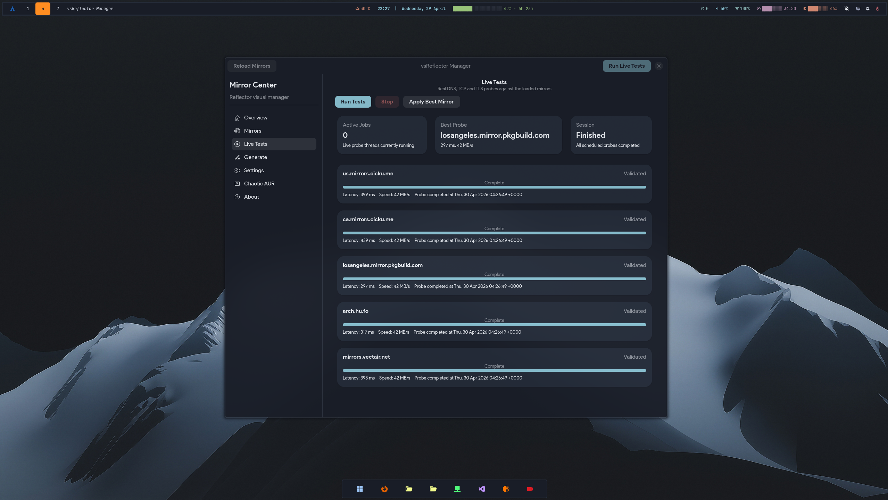

<h1 align="center">vsReflector Manager</h1>

<p align="center">
  
</p>

[](LICENSE)

A visual mirror manager for Arch Linux built with GTK4 and libadwaita.

Inspect your current mirrorlist, run real DNS/TCP/TLS probes, generate optimized lists with `reflector`, and manage your Chaotic AUR mirrorlist — all from a single GUI with no terminal needed.

---

## Screenshots

### Live Tests


---

## Features

- **Dashboard** — live overview of mirror source, count, median latency and best candidate
- **Mirrors** — visual rows with country, protocol, sync age, latency, speed and health status; filter by source, protocol or health
- **Live Tests** — real DNS, TCP and TLS probes against your mirrors; session-aware cancellation; one-click apply best result
- **Generate** — build a new mirrorlist with `reflector`, preview the diff against the current one, apply with automatic timestamped backup
- **Restore** — roll back to any previous backup from a dropdown
- **Settings** — all `reflector` filter options: countries (picker UI), protocols, age, sort strategy, completion %, timeout, IPv4/IPv6 flags
- **Chaotic AUR** — detect install/config state, probe all mirrors, toggle active mirrors per-entry, apply selection or apply fastest probe result
- **Pacman** — toggle Color, VerbosePkgLists, ILoveCandy (Pac-Man progress bar), set ParallelDownloads, and enable/disable optional repos (multilib, core-testing, extra-testing, multilib-testing) — writes `/etc/pacman.conf` via polkit
- **About** — version, author, links

---

## Requirements

- `python` (3.11+)
- `python-gobject`
- `gtk4`
- `libadwaita`
- `polkit` — required for writing to `/etc/pacman.d/`

Optional:

- `reflector` — needed for the Generate tab
- `python-gdkpixbuf2` / `gdk-pixbuf2` — for PNG icon rendering in the About tab

---

## Installation

### Manual

```bash
git clone https://github.com/victorsosaMx/vsReflector-Manager
cd vsReflector-Manager
chmod +x vsreflector-manager
./vsreflector-manager
```

### Desktop integration

Copy the included desktop entry to your applications folder:

```bash
cp vsreflector-manager.desktop ~/.local/share/applications/
```

Edit `Exec=` and `Icon=` paths inside the file to match where you cloned the repo.

---

## Usage guide

### First run

Launch the app. The **Dashboard** shows how many mirrors were loaded and from which source (system mirrorlist, Arch API, or demo fallback). If `reflector` is not installed, a warning appears — the app still works for inspecting and probing mirrors.

### Inspecting mirrors

Go to **Mirrors**. Every entry shows country, protocol, sync age, estimated latency and health. Use the filter chips at the top to narrow down by source, protocol or health status.

### Running live probes

Click **Run Live Tests** in the header bar — or go to the **Live Tests** tab and click **Run Tests**. The app opens real DNS, TCP and TLS connections to each mirror and updates the latency chips in real time.

When all probes finish, **Apply Best Mirror** becomes active. Clicking it confirms and writes the top probe results to `/etc/pacman.d/mirrorlist` (polkit dialog appears).

### Generating a mirrorlist with reflector

1. Go to **Settings** — configure countries, protocols, age, sort strategy and other `reflector` flags. Settings are saved automatically on close.
2. Go to **Generate** — click **Generate Preview**. The app runs `reflector` in the background and shows the output mirrorlist and a unified diff against the current one.
3. Review the diff, then click **Apply Mirrorlist** to write it. A timestamped backup is created automatically.
4. To roll back, click **Restore from Backup** and pick a backup from the list.

### Pacman settings

Go to **Pacman**. Adjust any of the following and click **Apply Changes** — a polkit dialog will appear to authorize the write to `/etc/pacman.conf`:

- **Color** — colored pacman output
- **Verbose package lists** — show old/new versions on upgrade
- **ILoveCandy** — replace the `####` progress bar with a Pac-Man animation
- **Parallel downloads** — number of simultaneous package downloads (1–20)
- **Repositories** — enable or disable `[multilib]`, `[core-testing]`, `[extra-testing]`, `[multilib-testing]`

Changes are applied in-place; comments and the rest of the file are preserved.

---

### Chaotic AUR

Go to **Chaotic AUR**. The tab shows the current state:

- **Not installed** — copy and run the displayed commands to install the keyring and mirrorlist package.
- **Installed, not configured** — copy the `[chaotic-aur]` snippet and add it to `/etc/pacman.conf`, then click **Refresh Status**.
- **Ready** — all mirrors are listed with enable/disable switches. Click **Probe All Mirrors** to test latency. Use **Apply Changes** to write your toggle selection, or **Apply Best Mirror** to activate only the fastest probe result.

---

## Data sources

The app loads mirrors from the first available source in this order:

1. **System mirrorlist** — `/etc/pacman.d/mirrorlist`, parsed directly
2. **Arch Mirror Status API** — `https://archlinux.org/mirrors/status/json/`, used when no local mirrorlist is available; cached for 1 hour
3. **Demo dataset** — built-in fallback if neither source is reachable

---

## Chaotic AUR

The Chaotic AUR tab detects whether the `chaotic-mirrorlist` package is installed and whether `[chaotic-aur]` is present in `/etc/pacman.conf`.

- **Not installed** — shows the official installation commands to copy/run
- **Installed, not configured** — shows the `pacman.conf` snippet to add
- **Fully set up** — shows all mirrors with enable/disable toggles, probe latency chips and apply controls

Changes to the mirrorlist are written via `pkexec` and do not affect installed packages or the `[chaotic-aur]` section.

More info: [aur.chaotic.cx](https://aur.chaotic.cx/)

---

## Applying changes

The generated mirrorlist, Chaotic AUR changes, and Pacman options are all written using `pkexec sh -c` — a polkit authentication dialog will appear before any write to `/etc/pacman.d/` or `/etc/pacman.conf`.

All applies to `/etc/pacman.d/mirrorlist` create a timestamped backup (`.bak.YYYYMMDD-HHMMSS`) in the same directory.

---

## License

MIT — do whatever you want, credit appreciated.

---

*Made with GTK4, libadwaita and too much caffeine.*
